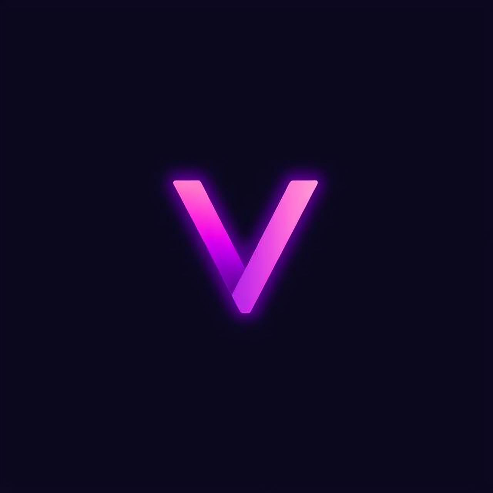

<div align="center">
  

  <div align="center">
    
  </div>

  
  <br>
  
  [](https://cloned.creditcard)
  &nbsp;&nbsp;
  [](https://www.youtube.com/@iamvux)
  &nbsp;&nbsp;
  

  <br>

  ```lua
  loadstring(game:HttpGet("https://raw.githubusercontent.com/onlyabletolove/vux/refs/heads/main/vux.lua", true))()